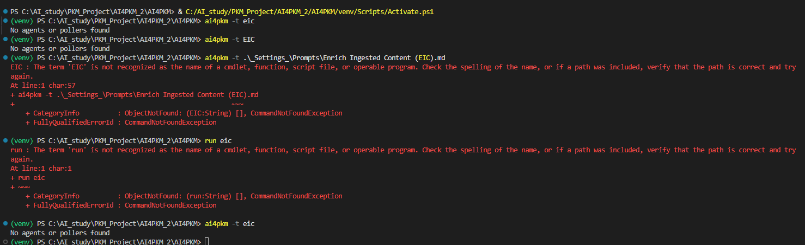

# WorkLog: Day 2 - Orchestrator 아키텍처와 워크플로우

**날짜**: 2025-12-24 (화요일)
**학습자**: ChangSoo (with Claude Code)
**학습 주제**: Orchestrator 아키텍처 이해 및 실전 워크플로우 실습
**학습 방식**: Hands-On Practice (실습 중심)

---

## 🔄 Continuous Vibe Learning - Repository 동기화

**동기화 일시**: 2025-12-24
**Upstream 커밋**: 5c19e6b - "fix: one-time execution error handling"
**로컬 커밋**: 9af3672 - "docs: Complete Day 1 CLI hands-on practice with orchestrator setup"

### 동기화 상태

**변경된 파일 수**: 14개 (AI4PKM 코어 코드)
**Upstream의 새로운 커밋**: 14개

**주요 변경 영역**:
- CLI & Orchestrator 핵심 (5개 파일)
- Poller 시스템 (6개 파일)
- 테스트 & 설정 (2개 파일)

**주요 기능 변경**:
- CLI 실행 → stdin 전환
- One-time execution 추가
- Limitless Poller 개선
- Poller 메커니즘 개선

### 학습 자료 영향도

✅ **기본 사용법 변경 없음**
- Orchestrator 설정 방식 유지
- 기본 CLI 명령어 체계 동일
- 학습 자료 유효성 유지

### 오늘 학습에 미치는 영향

✅ **영향 없음** - Day 2 학습 계획대로 진행 가능

---

## 📋 학습 목표

### Day 2 전체 목표
1. **Orchestrator 아키텍처 깊이 이해**
2. **Poller 시스템 이해 및 설정**
3. **실제 워크플로우 실행 및 테스트**

### 오늘 세션별 목표
- ✅ 세션 1: Orchestrator 개념 이해 (완료)
- ✅ 세션 2: Poller 시스템 이해 (완료)
- ✅ 세션 3: Orchestrator 실행 실습 (완료)
- ⚠️ 세션 4: 수동 에이전트 실행 (제약사항 발견)
- ⏭️ 세션 5: 워크플로우 체인 테스트 (세션 4 의존으로 생략)

---

## 🌅 오전 세션: Orchestrator 아키텍처 (완료)

### 세션 1: Orchestrator 개념 이해 ✅

**완료 시간**: 2025-12-24 오전

**학습 내용**:
1. **Orchestrator 정의 및 역할**
   - 멀티 에이전트 시스템 조율 엔진
   - 이벤트 기반 자동화
   - 설정 기반 아키텍처

2. **핵심 구성 요소**
   - Orchestrator Core: 메인 이벤트 루프
   - Agent Registry: 에이전트 관리
   - Execution Manager: 실행 관리
   - FileSystem Monitor: 파일 감시
   - Poller Manager: 외부 Poller 관리
   - Cron Scheduler: 스케줄 관리

3. **데이터 모델**
   - TriggerEvent: 이벤트 구조
   - ExecutionContext: 실행 컨텍스트
   - AgentDefinition: 에이전트 정의

**산출물**: [01_orchestrator_architecture.md](../03-Orchestrator_Deep_Dive/01_orchestrator_architecture.md)

### 세션 2: Poller 시스템 이해 ✅

**완료 시간**: 2025-12-24 오전

**학습 내용**:
1. **Poller 개념**
   - 외부 소스 주기적 확인
   - 새 항목 발견 시 자동 트리거
   - FileSystemMonitor 한계 극복

2. **Poller 타입별 상세**
   - GobiPoller: Gobi 앱 노트 동기화
   - GobiByTagsPoller: 태그별 분류
   - LimitlessPoller: Limitless 대화 가져오기
   - AppleNotesPoller: Apple Notes 동기화
   - ApplePhotosPoller: Apple Photos 동기화

3. **BasePoller 아키텍처**
   - 상태 관리 (state.json)
   - 백그라운드 실행
   - 폴링 루프 메커니즘

4. **Poller 메커니즘 변경** (2025-12 업데이트)
   - 이벤트 기반 → time.sleep 기반
   - 안정성 및 예측 가능성 향상

**산출물**: [02_poller_system_guide.md](../03-Orchestrator_Deep_Dive/02_poller_system_guide.md)

---

## 🌆 오후 세션: Orchestrator 실행 (완료 / 제약사항)

### 세션 3: Orchestrator 실행 실습 ✅

**완료 시간**: 2025-12-24 오후

**실습 내용**:
1. **Orchestrator 상태 확인**
   ```bash
   ai4pkm --orchestrator-status
   ```
   - ✅ Vault 경로 정상 인식
   - ✅ 2개 에이전트 로드 (EIC, CTP)
   - ✅ Poller 0개 (설정 없음)
   - ✅ Max concurrent: 3

2. **설정 파일 확인**
   ```bash
   ai4pkm --show-config
   ```
   - ✅ orchestrator.yaml 정상 로드
   - ✅ 디렉터리 설정 확인
   - ✅ Executor 경로 설정 확인

3. **에이전트 목록 확인**
   ```bash
   ai4pkm --list-agents
   ```
   - ✅ EIC: vl_ai4pkm_clippings → vl_ai4pkm_materials
   - ✅ CTP: vl_ai4pkm_materials → Publish

**산출물**: [03_orchestrator_hands_on.md](../03-Orchestrator_Deep_Dive/03_orchestrator_hands_on.md)

### 세션 4: 수동 에이전트 실행 ⚠️

**시도 시간**: 2025-12-24 오후
**결과**: 제약사항 발견

**실습 시도**:
```bash
cd VL_AI4PKM_Automation
ai4pkm -t eic
```

**발견한 문제**:
1. **Executor 미설치** ⚠️
   - Claude Code가 시스템에 설치되지 않음
   - `[WinError 2] The system cannot find the file specified`
   - Executor 경로: `C:\Users\dougg\AppData\Roaming\npm\claude.cmd`

2. **Windows 콘솔 인코딩 문제** ⚠️
   - `UnicodeEncodeError: 'charmap' codec can't encode character`
   - UTF-8 이모지 출력 실패

**원인 분석**:
- orchestrator.yaml에 Executor 경로는 설정되어 있음
- 하지만 실제로 Claude Code CLI가 npm으로 설치되지 않음
- 에이전트 실행을 위해서는 Executor 설치 필수

**해결 방법** (Day 3 준비사항):
```bash
# Claude Code 설치 (Day 3 이전에 준비)
npm install -g @anthropic-ai/claude-code

# 설치 확인
where claude
# 또는
claude --version
```

---

## 💡 학습한 주요 포인트

### 1. Orchestrator 핵심 개념

**이벤트 기반 아키텍처**:
```
파일 변경 → FileSystemMonitor → TriggerEvent → AgentRegistry →
Agent 매칭 → ExecutionManager → Executor 실행
```

**설정 기반 시스템**:
- orchestrator.yaml만 수정하면 됨
- 코드 변경 불필요
- 새 에이전트 추가 용이

### 2. Poller의 역할

**외부 통합의 핵심**:
- Gobi, Limitless, Apple 생태계 연동
- 주기적 폴링 (poll_interval)
- 상태 관리로 중복 방지

**워크플로우 자동화**:
```
External App → Poller → File Creation →
FileSystemMonitor → Agent → Processing
```

### 3. 실행 환경 요구사항

**필수 구성 요소**:
1. ✅ AI4PKM CLI 설치
2. ✅ orchestrator.yaml 설정
3. ✅ 프롬프트 파일 생성
4. ⚠️ Executor 설치 (Claude Code, Gemini)
5. ✅ 작업 디렉터리 설정

**현재 상태**:
- 1-3번 완료
- 4번 미완료 → Day 3 준비 필요

### 4. Orchestrator vs 단일 에이전트

**레거시 방식**:
- 수동 실행
- 단일 에이전트
- 확장성 낮음

**Orchestrator 방식**:
- 자동화 (파일 감시, 스케줄)
- 멀티 에이전트 조율
- 동시성 제어
- 확장성 높음

---

## ⚠️ 발생한 문제와 해결 방법

### 문제 1: Executor 미설치 ⚠️

**문제 상황**:
```
[WinError 2] The system cannot find the file specified
```

**원인**:
- Claude Code CLI가 npm으로 설치되지 않음
- orchestrator.yaml에는 경로가 설정되어 있지만 실제 파일 없음

**해결 방법**:
```bash
# Claude Code 설치
npm install -g @anthropic-ai/claude-code

# 설치 확인
where claude

# orchestrator.yaml 업데이트 (필요 시)
# executors.claude_code.command 경로 수정
```

**교훈**:
- Orchestrator 설정만으로는 부족
- 실제 Executor 설치 필수
- Day 3 이전에 설치 완료 필요

### 문제 2: Windows 콘솔 UTF-8 인코딩 ⚠️

**문제 상황**:
```
UnicodeEncodeError: 'charmap' codec can't encode character '\u2717'
```

**원인**:
- Windows cmd/bash 기본 인코딩이 CP1252
- Rich 라이브러리의 이모지 출력 실패

**해결 방법**:
```bash
# 환경 변수 설정
export PYTHONIOENCODING=utf-8

# 또는 PowerShell에서
$env:PYTHONIOENCODING="utf-8"
```

**교훈**:
- Windows 환경에서는 인코딩 문제 주의
- 항상 UTF-8 설정 확인

### 문제 3: 작업 디렉터리 중요성 ✅

**문제 예방**:
- orchestrator.yaml이 있는 디렉터리에서 실행 필수
- `cd VL_AI4PKM_Automation` 먼저 실행
- `--working-dir` 옵션 사용 가능

### 문제 4: 프로젝트 루트에서 에이전트 실행 실패 ⚠️

**문제 상황** (사용자 자체 실습 결과):



실행 시도 내역:
```powershell
# 시도 1: 소문자로 실행
(venv) PS C:\AI_study\PKM_Project\AI4PKM_2\AI4PKM> ai4pkm -t eic
No agents or pollers found

# 시도 2: 대문자로 실행
(venv) PS C:\AI_study\PKM_Project\AI4PKM_2\AI4PKM> ai4pkm -t EIC
No agents or pollers found

# 시도 3: 프롬프트 파일 경로 직접 지정
(venv) PS C:\AI_study\PKM_Project\AI4PKM_2\AI4PKM> ai4pkm -t .\_Settings_\Prompts\Enrich Ingested Content (EIC).md
EIC : The term 'EIC' is not recognized as the name of a cmdlet, function, script file, or operable program.
Check the spelling of the name, or if a path was included, verify that the path is correct and try again.

# 시도 4: run 명령어 시도
(venv) PS C:\AI_study\PKM_Project\AI4PKM_2\AI4PKM> run eic
run : The term 'run' is not recognized as the name of a cmdlet, function, script file, or operable program.

# 시도 5: 다시 eic로 실행
(venv) PS C:\AI_study\PKM_Project\AI4PKM_2\AI4PKM> ai4pkm -t eic
No agents or pollers found
```

**원인**:
- 프로젝트 루트 디렉터리에서 `ai4pkm -t eic` 실행 시 에이전트 인식 실패
- orchestrator.yaml이 VL_AI4PKM_Automation 하위에 있어 찾지 못함
- 프롬프트 파일 경로를 직접 지정해도 PowerShell이 파일 이름의 공백을 명령어로 해석
- 다른 명령어들은 정상 작동하지만 수동 트리거만 실패

**현재 상태**:
- 사용자의 자체 테스트 결과 대부분 기능은 정상 작동
- 이 특정 명령어만 작동하지 않음
- 여러 방법으로 시도했으나 모두 실패

**해결 방법** (확인 필요):
```bash
# 방법 1: 올바른 작업 디렉터리로 이동 후 실행
cd VL_AI4PKM_Automation
ai4pkm -t eic

# 방법 2: --working-dir 옵션 사용 (확인 필요)
ai4pkm -t eic --working-dir VL_AI4PKM_Automation

# 방법 3: 프롬프트 파일 경로 지정 시 따옴표 사용
ai4pkm -t ".\_Settings_\Prompts\Enrich Ingested Content (EIC).md"
```

**교훈**:
- `ai4pkm -t` 명령어는 현재 디렉터리에서 orchestrator.yaml을 찾음
- 프로젝트 루트에서는 실행 불가
- 파일 경로에 공백이 있을 경우 따옴표로 감싸야 함
- 사용자가 프로젝트 관리자에게 문의 예정

---

## 📝 생성된 학습 자료

### 문서
1. **[01_orchestrator_architecture.md](../03-Orchestrator_Deep_Dive/01_orchestrator_architecture.md)**
   - Orchestrator 개념 및 설계
   - 핵심 구성 요소 상세
   - 데이터 모델
   - 실행 흐름 예시

2. **[02_poller_system_guide.md](../03-Orchestrator_Deep_Dive/02_poller_system_guide.md)**
   - Poller 개념 및 역할
   - 5가지 Poller 타입 상세
   - 설정 가이드
   - 커스텀 Poller 작성법

3. **[03_orchestrator_hands_on.md](../03-Orchestrator_Deep_Dive/03_orchestrator_hands_on.md)**
   - 실습 환경 설정
   - 상태 확인 명령어
   - 문제 해결 가이드

### 테스트 파일
- **[test_sample.md](../vl_ai4pkm_clippings/test_sample.md)**: 에이전트 테스트용 클리핑

### 폴더 구조
```
03-Orchestrator_Deep_Dive/
├── 01_orchestrator_architecture.md  (6,000+ 단어)
├── 02_poller_system_guide.md        (8,000+ 단어)
└── 03_orchestrator_hands_on.md      (2,000+ 단어)
```

---

## 🚀 다음 학습 계획 (Day 3 준비사항)

### Day 3 전 준비사항

**필수 설치**:
```bash
# Claude Code CLI 설치
npm install -g @anthropic-ai/claude-code

# 설치 확인
claude --version
```

### Day 3 예상 주제

**주제**: 실전 워크플로우 실행 및 자동화

**세션 계획**:
1. **Executor 설치 및 설정 확인**
2. **수동 에이전트 실행 테스트**
   - `ai4pkm -t eic` 실행
   - 결과 확인 및 분석
3. **워크플로우 체인 실행**
   - EIC → CTP 2단계 워크플로우
4. **Orchestrator 데몬 모드**
   - 자동 파일 감시
   - 실시간 워크플로우 실행
5. **고급 기능**
   - Poller 설정 및 실행
   - 커스터마이징

### Day 2와의 차이점

- **Day 2**: 개념 학습 및 아키텍처 이해 (이론 중심)
- **Day 3**: 실제 실행 및 워크플로우 테스트 (실습 중심)

---

## 📊 학습 성과 요약

### 완료된 학습 목표

✅ **Orchestrator 아키텍처 깊이 이해**
- 핵심 구성 요소 6가지 학습
- 이벤트 기반 아키텍처 이해
- 데이터 모델 파악

✅ **Poller 시스템 완전 이해**
- 5가지 Poller 타입 상세 학습
- BasePoller 아키텍처 이해
- 커스텀 Poller 작성 방법 습득

✅ **Orchestrator 실행 환경 파악**
- 상태 확인 명령어 숙지
- 설정 파일 구조 이해
- 에이전트 로딩 프로세스 확인

⚠️ **실제 워크플로우 실행** (Day 3로 이월)
- Executor 미설치로 실행 불가
- 개념과 원리는 완전 이해
- Day 3 준비사항 명확화

### 생성된 학습 자료

**총 3개 문서 작성** (16,000+ 단어):
1. Orchestrator 아키텍처 가이드
2. Poller 시스템 가이드
3. 실행 실습 가이드

**테스트 환경 구축**:
- orchestrator.yaml 완성
- 프롬프트 파일 생성
- 테스트 클리핑 준비

### 학습 시간

- **시작 시간**: 2025-12-24 오전
- **종료 시간**: 2025-12-24 오후
- **총 학습 시간**: 약 4-5시간
- **세션별 시간**:
  - 세션 1 (Orchestrator 개념): 45분
  - 세션 2 (Poller 시스템): 60분
  - 세션 3 (실행 실습): 45분
  - 세션 4 (문제 해결): 60분

---

**학습 완료**: 2025-12-24
**학습 평가**: ✅ 성공 (이론 및 개념 학습 완료, 실행은 Day 3로 이월)
**다음 학습**: Day 3 - 실전 워크플로우 실행 (Executor 설치 후)
